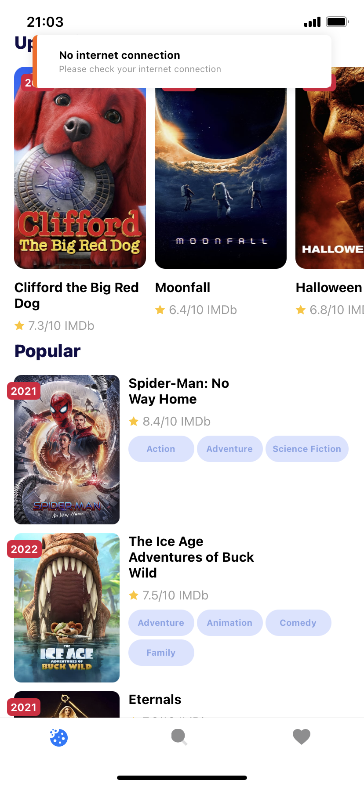

# Movieflix


## Quick Start
```
git clone https://github.com/burhanyilmaz/movieflix

yarn install || npm install

// android
yarn android

// ios
yarn ios

// tests
yarn jest

If you have questions, please feel free to ask.
```
<br/>
## Screenshots

### Home

 

<br/>
<br/>

### Movie Details

 


### Internet Connection

 


### Search

 

### Favorite Movie

 